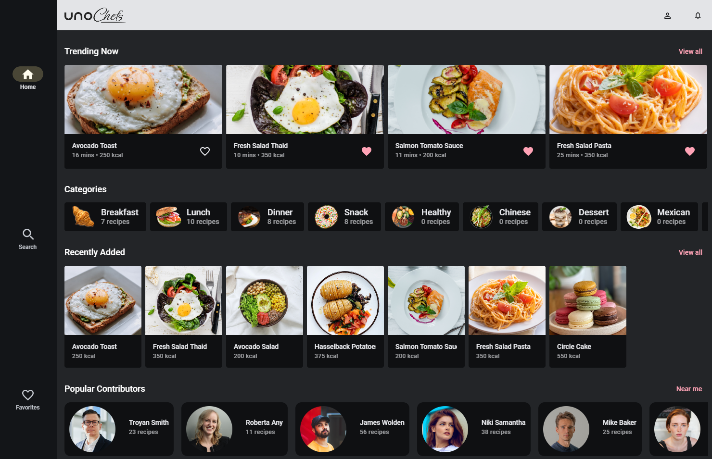

	<picture>
	  <source media="(prefers-color-scheme: dark)" srcset="https://github.com/user-attachments/assets/e649c6d5-f83d-4aee-b304-403a66b75d8f">
	  <source media="(prefers-color-scheme: light)" srcset="https://github.com/user-attachments/assets/d74719cf-c519-47b2-bb1d-eeb52395dc5d">
		
	</picture>

## Releases

### Canary

[)
](https://green-wave-0d2d8e10f-canaryskia.eastus2.2.azurestaticapps.net/)[)
](https://green-wave-0d2d8e10f-canary.eastus2.2.azurestaticapps.net/)

[)](https://testflight.apple.com/v1/app/6742193286)
[)](https://testflight.apple.com/v1/app/6448395937)

[)](https://play.google.com/store/apps/details?id=uno.platform.chefs.skia_canary)
[)](https://appcenter.ms/orgs/unoplatform/apps/Uno-Chefs-Canary/distribute/releases)

### Stable

[)
](https://green-wave-0d2d8e10f-skia.eastus2.2.azurestaticapps.net/)[)
](https://green-wave-0d2d8e10f-native.eastus2.2.azurestaticapps.net/)

[)](https://testflight.apple.com/v1/app/6742193353)
[)](https://testflight.apple.com/v1/app/6448395831)

[)](https://play.google.com/store/apps/details?id=uno.platform.chefs.skia)
[)](https://appcenter.ms/orgs/unoplatform/apps/Uno-Chefs/distribute/releases)

## Overview

**Uno Chefs** is a modern, interactive recipe app built to show what Uno Platform can really do in a real-world, production-ready application.

With Uno Chefs, you can dive into a world of cooking inspiration! Register, log in, and start exploring recipes with step-by-step instructions and video tutorials. You’ll be able to check nutritional info through charts, check reviews, favorite your top picks, and filter results to match your taste.

But there’s more! You can discover contributors and their creations, see who’s cooking nearby on an interactive map, build your own personalized cookbooks, check notifications, and access the settings page.

## Features

This app demonstrates the use of many Uno Platform capabilities, such as:

- **Theming** with Material Design
- **Controls and helpers** from the Uno Toolkit
- **Responsive** views
- **State management** using MVUX
- **Configuration management**
- **HTTP** communication with **Kiota**
- **Serialization**
- **Complex navigation scenarios**
- **MediaPlayerElement** for video playback
- **ThemeService** to switch between light and dark modes
- **Authentication**
- **Skia rendering**

In addition, when running the application, users can choose to use **mock data** or connect to the **included API project** in the Chefs solution.

## Recipe Book

There is a companion set of reference documentation known as the [Recipe Book](https://platform.uno/docs/articles/external/uno.chefs/doc/RecipeBooksOverview.html). These guidelines document how each feature of Chefs is implemented in an easy-to-read format.
