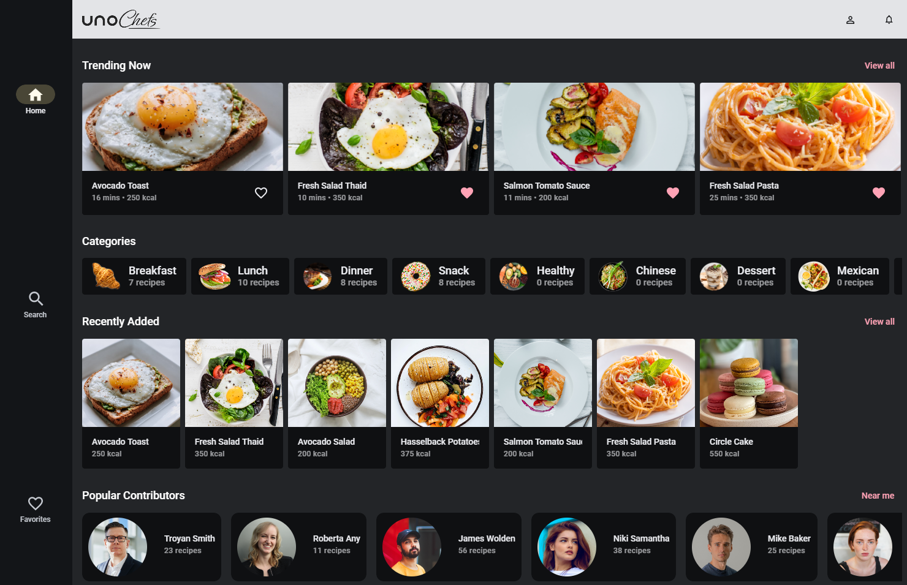

# Uno Chefs

## Overview

**Uno Chefs** is a modern, interactive recipe app built to show what Uno Platform can really do in a real-world, delightful scenario.

With Uno Chefs, you can dive into a world of cooking inspiration! Register, log in, and start exploring recipes with step-by-step instructions and video tutorials. You’ll be able to check nutritional info through charts, check reviews, favorite your top picks, and filter results to match your taste.

But there’s more! You can discover contributors and their creations, see who’s cooking nearby on an interactive map, build your own personalized cookbooks, check notifications, and access the settings page.

## Features

This app demonstrates the use of many Uno Platform capabilities, such as:

- **Theming** with Material Design
- **Controls and helpers** from the Uno Toolkit
- **Responsive** views
- **State management** using MVUX
- **Configuration management**
- **HTTP** communication with **Kiota**
- **Serialization**
- **Complex navigation scenarios**
- **MediaPlayerElement** for video playback
- **ThemeService** to switch between light and dark modes
- **Authentication**
- **Skia rendering**

In addition, when running the application, users can choose to use **mock data** or connect to the **included API project** in the Chefs solution.

## Source Code

You can find the full solution on GitHub: [UnoChefs GitHub Repository](https://github.com/unoplatform/uno.chefs)

## Recipe Books

We’ve prepared a special section with **Recipe Books** on how to use various Uno Platform features, all demonstrated through the Uno Chefs app. Each Recipe Book shows you how a specific functionality works-complete with explanations, code snippets, and real examples from the app itself.

Whether you're curious about theming, navigation, responsive views, the Recipe Books will guide you step by step so you can understand and apply these concepts in your own projects.

For more details, check out the [Recipe Book Overview](xref:Uno.Recipes.Overview).
