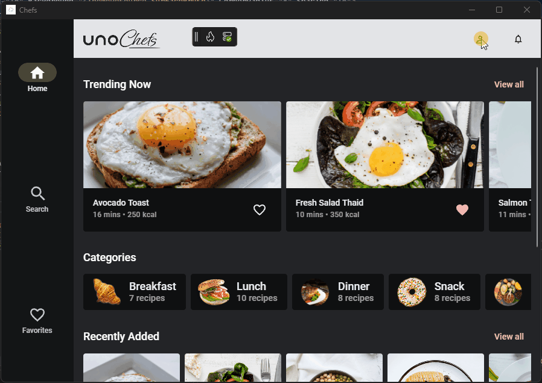

# How to Handle Theme Switching

> **UnoFeatures:** `Hosting` (add to `<UnoFeatures>` in your `.csproj`).

## Problem

Currently, there is no way to switch application themes at runtime from any layer, including view models. There is also a need to have a way to store the current theme and be able to initialize the app to the persisted theme preference.

## Solution

The **Uno.Extensions** library addresses this problem by providing an injectable implementation of an `IThemeService` interface that can be registered as part of the `IHostBuilder` from `Uno.Extensions.Hosting`.

### Adding ThemeService

To integrate `ThemeService` in your Uno application, follow these steps:

#### App Startup Configuration

1. Register the `IThemeService` in your app startup:

    ``` csharp
    public partial class App : Application
    {
        protected async override void OnLaunched(LaunchActivatedEventArgs args)
        {
            var builder = this.CreateBuilder(args)
                .Configure(host => host
                    .UseThemeSwitching()
                );
                // Code omitted for brevity
        }
    }
    ```

1. Consume the ThemeService in your view model:

    ```csharp
    public partial record SettingsModel
    {
        private readonly IThemeService _themeService;

        public SettingsModel(IThemeService themeService)
        {
            _themeService = themeService;
        }

        public IListFeed<AppTheme> ThemeOptions => State
		.Value(this, () => Enum.GetValues<AppTheme>().ToImmutableList())
            .AsListFeed()
            .Selection(Theme);

        public IState<AppTheme> Theme => State
            .Value(this, () => _themeService.Theme)
            .ForEach(async (theme, _) => await _themeService.SetThemeAsync(theme));
    }
    ```

1. Use the `Theme` `IState` in your XAML to bind to the current theme and allow the user to change it:

    ```xml
    <ComboBox ItemsSource="{Binding ThemeOptions}"
          SelectedItem="{Binding Theme, Mode=TwoWay}"
          HorizontalAlignment="Right" />
   ```

## Listening to Theme Changes

To listen for theme changes, you can subscribe to the `OnThemeChanged` event provided by the `IThemeService`. This allows you to react to theme changes in your application, such as updating UI elements or sending messages.

```csharp
public partial record SettingsModel
{
    private readonly IThemeService _themeService;
    private readonly IMessenger _messenger;
    
    public SettingsModel(IThemeService themeService
                         IMessenger messenger)
    {
        _themeService = themeService;
        _messenger = messenger;
        _themeService.ThemeChanged += OnThemeChanged; // Subscribe to theme changes
    }

    private void OnThemeChanged(object? sender, AppTheme theme) => _messenger.Send(new ThemeChangedMessage(theme));

    // Code omitted for brevity
}
```

**Visual Result:**



## Source Code

- [SettingsPage](https://github.com/unoplatform/uno.chefs/blob/c87c6ab4cd4749a28485b8e9b403575b35f701de/Chefs/Views/SettingsPage.xaml)
- [SettingsModel](https://github.com/unoplatform/uno.chefs/blob/c87c6ab4cd4749a28485b8e9b403575b35f701de/Chefs/Presentation/SettingsModel.cs)
- [ThemeChangedMessage](https://github.com/unoplatform/uno.chefs/blob/c87c6ab4cd4749a28485b8e9b403575b35f701de/Chefs/Presentation/Messages/ThemeChangedMessage.cs)
