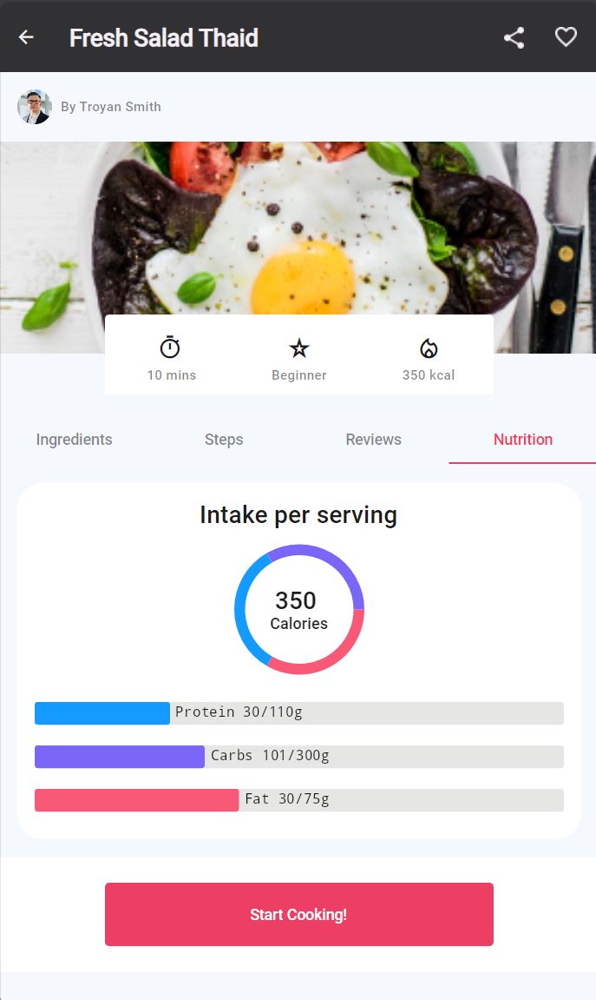

# How to integrate LiveCharts controls
 
## Problem
 
Mobile and desktop applications often need to display complex data in an easy-to-understand format. Charts are an excellent tool for this, but integrating charting functionality into applications, especially cross-platform ones, can be challenging due to the variety of data sources and formats, as well as the need for responsive and intuitive user interaction.
 
## Solution

**LiveCharts** is a flexible and customizable charting library that can be integrated into any .NET application, including Uno platform apps. It provides various chart types, from basic line and bar charts to more complex heat maps and financial charts.

### App startup configuration

```csharp
public class App : Application
{
  // Code omitted for brevity

  protected async override void OnLaunched(LaunchActivatedEventArgs args)
  {
    // Code omitted for brevity

    LiveCharts.Configure(config =>
      config
      .HasMap<NutritionChartItem>((nutritionChartItem, point) =>
      {
        // here we use the index as X, and the nutrition value as Y
        return new(point, nutritionChartItem.Value);
      })
    );

    // Code omitted for brevity
  }
}
```

### Custom chart control

```xml
<UserControl xmlns:lvc="using:LiveChartsCore.SkiaSharpView.WinUI">

  <!-- Code omitted for brevity -->

  <!-- UserControl used for LiveCharts2 components to avoid having to data-bind the chart properties to the Model -->
  <!-- Currently a bug in LiveCharts2 that causes a crash when setting DataContext to null: https://github.com/beto-rodriguez/LiveCharts2/issues/1422 -->

  <lvc:PieChart x:Name="pieChart" />

  <lvc:CartesianChart x:Name="cartesianChart"
                      TooltipPosition="Hidden" />
</UserControl>
```

### Chart control code-behind

```csharp
public sealed partial class ChartControl : UserControl
{
  private Recipe? _recipe;
  public ChartControl()
  {
    this.InitializeComponent();

    _recipe = DataContext as Recipe;
    if (_recipe != null)
    {
      BuildColumnChart();
      BuildDoughnutChart();
    }

    DataContextChanged += OnDataContextChanged;
  }

  private void OnDataContextChanged(FrameworkElement sender, DataContextChangedEventArgs args)
  {
    _recipe = args.NewValue as Recipe;

    if (_recipe != null)
    {
      BuildColumnChart();
      BuildDoughnutChart();
    }
  }

  private void BuildColumnChart()
  {
    //Build column chart
    var _chartdata = new NutritionChartItem[]
    {
      new(nameof(Nutrition.Fat),_recipe?.Nutrition.Fat,_recipe?.Nutrition.FatBase,GetNutritionColorPaint(nameof(Nutrition.Fat))),
      new(nameof(Nutrition.Carbs),_recipe?.Nutrition.Carbs,_recipe?.Nutrition.CarbsBase,GetNutritionColorPaint(nameof(Nutrition.Carbs))),
      new(nameof(Nutrition.Protein),_recipe?.Nutrition.Protein,_recipe?.Nutrition.ProteinBase, GetNutritionColorPaint(nameof(Nutrition.Protein)))
    };

    var rowSeries = new RowSeries<NutritionChartItem>
    {
      Values = _chartdata,
      DataLabelsPaint = new SolidColorPaint(GetSKColorFromResource("NutritionDataLabelColor")),
      DataLabelsPosition = DataLabelsPosition.Right,
      DataLabelsFormatter = point => $"{point.Model!.Name} {point.Model!.ChartProgressVal}/{point.Model!.MaxValueRef}g",
      DataLabelsSize = 13,
      IgnoresBarPosition = true,
      MaxBarWidth = 22,
      Padding = 1,

      IsVisibleAtLegend = true
    }.OnPointMeasured(point =>
    {
      if (point.Visual is null) return;
      point.Visual.Fill = point.Model!.ColumnColor;
    });
    //End

    //Build column background
    var chartlimit = new NutritionChartItem[]
    {
      new(),
      new(),
      new()
    };

    var rowSeriesLimit = new RowSeries<NutritionChartItem>
    {
      Values = chartlimit,
      IgnoresBarPosition = true,
      MaxBarWidth = 22,
      Padding = 1,
      Fill = new SolidColorPaint(GetSKColorFromResource("NutritionTrackBackgroundColor"))
    };
    //End

    cartesianChart.Series = new[] { rowSeriesLimit, rowSeries };
    cartesianChart.XAxes = new[] { new Axis { IsVisible = false, MaxLimit = 1000 } };
    cartesianChart.YAxes = new[] { new Axis { IsVisible = false } };
  }

  private void BuildDoughnutChart()
  {
    var c = new ISeries[]
    {
      new PieSeries<int>
      {
        Values = new []{ 5 },
        Fill = GetNutritionColorPaint(nameof(Nutrition.Fat)),
        InnerRadius = 60,
      },
      new PieSeries<int>
      {
        Values = new []{ 5},
        Fill = GetNutritionColorPaint(nameof(Nutrition.Protein)),
        InnerRadius = 60,
      },
      new PieSeries<int>
      {
        Values = new []{ 5 },
        Fill = GetNutritionColorPaint(nameof(Nutrition.Carbs)),
        InnerRadius = 60,
      }
    };

    pieChart.Series = c;
  }

  private SolidColorPaint GetNutritionColorPaint(string name)
  {
    return name switch
    {
      nameof(Nutrition.Carbs) => new SolidColorPaint(GetSKColorFromResource("NutritionCarbsValColor")),
      nameof(Nutrition.Protein) => new SolidColorPaint(GetSKColorFromResource("NutritionProteinValColor")),
      nameof(Nutrition.Fat) => new SolidColorPaint(GetSKColorFromResource("NutritionFatValColor")),
      _ => new SolidColorPaint(SKColors.Yellow),
    };
  }

  private SKColor GetSKColorFromResource(string resourceKey)
  {
    if (Resources.TryGetValue(resourceKey, out var resource) && resource is Color color)
    {
      return new SKColor(color.R, color.G, color.B, color.A);
    }

    return SKColor.Empty;
  }
}
```

### NutritionChartItem model

```csharp
public partial record NutritionChartItem
{
  public NutritionChartItem(int chartTrackVal = 1000)
  {
    Value = chartTrackVal;
  }

  public NutritionChartItem(string? name, double? value, double? maxValueRef, SolidColorPaint? columnColor = default)
  {
    Name = name;
    ColumnColor = columnColor;
    ChartProgressVal = value;

    var _val = value ?? 0;
    var _maxValueRef = maxValueRef ?? 0;
    var _tempValue = (_val / _maxValueRef) * 100;

    Value = _tempValue * 10;
    MaxValueRef = _maxValueRef;
  }

  public string? Name { get; }

  public double? ChartProgressVal { get; }

  public double Value { get; }

  public double MaxValueRef { get; }

  public SolidColorPaint? ColumnColor { get; }
}
```

### Chart control instance inside View

```xml
<ctrl:ChartControl DataContext="{Binding Recipe}" />
```

Doughtnut and horizontal bars chart on the Recipe details page:
<table>
  <tr>
    <th>LiveCharts</th>
  </tr>
  <tr>
    <td></td>
  </tr>
</table>

## Source Code

Chefs app 

- [App startup](https://github.com/unoplatform/uno.chefs/blob/f3b5a256aa7afd621389089ddea75d309e28c373/src/Chefs/App.cs#L61)
- [Custom chart control](https://github.com/unoplatform/uno.chefs/blob/f3b5a256aa7afd621389089ddea75d309e28c373/src/Chefs/Views/Controls/ChartControl.xaml#L2)
- [Chart control code-behind](https://github.com/unoplatform/uno.chefs/blob/f3b5a256aa7afd621389089ddea75d309e28c373/src/Chefs/Views/Controls/ChartControl.xaml.cs#L28)
- [Chart item model](https://github.com/unoplatform/uno.chefs/blob/a623c4e601f705621eb9ae622aa6e0f6984ee415/src/Chefs/Business/Models/NutritionChartItem.cs#L5)
- [Chart control instance](https://github.com/unoplatform/uno.chefs/blob/a623c4e601f705621eb9ae622aa6e0f6984ee415/src/Chefs/Views/RecipeDetailsPage.xaml#L427)

## Documentation

LiveCharts

- [Uno Platform installation](https://livecharts.dev/docs/UnoWinUi/2.0.0-rc1/Overview.Installation)
- [Doughnut chart](https://livecharts.dev/docs/UnoWinUi/2.0.0-beta.920/samples.pies.doughnut)
- [Bars chart](https://livecharts.dev/docs/UnoWinUi/2.0.0-beta.920/samples.bars.withBackground)