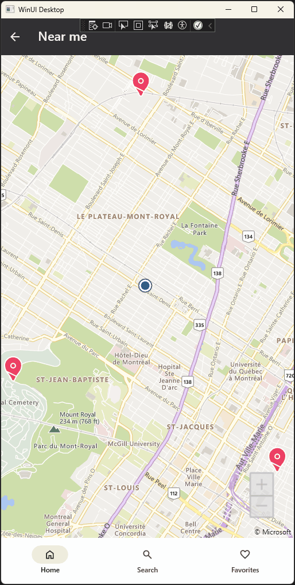

# Setting Up an Interactive Map

## Problem

Many apps need to show maps with things like points of interest, user location, or routes. This can be tricky, especially when you want the map to work across different platforms, because each platform has its own way of handling maps.

## Solution

Mapsui is a map library for .NET that works on multiple platforms. It lets you add maps to your app, with features like custom pins. Mapsui makes it easier to display maps in your app without worrying about the specific APIs of each platform.



### Adding Mapsui to your page

Start by adding the map element in your page.

```xml
<map:MapControl x:Name="MapControl"
                utu:AutoLayout.PrimaryAlignment="Stretch" />
```

### Setting up the map page

In the code-behind file, import Mapsui.

```csharp
public sealed partial class MapPage : Page
{
    private static Mapsui.Map? _map;

    public MapPage()
    {
        this.InitializeComponent();
        this.Loaded += (sender, e) => InitializeMap();
    }

    private void InitializeMap()
    {
        _map = MapControl.Map;
        AddBaseLayer();
        AddPinsLayer();
        AddMyLocationLayer();
        _map.Info += MapOnInfo;
    }

    // Code omitted for brevity
}
```

## Source Code

Chefs app

- [MapPage.xaml.cs](https://github.com/unoplatform/uno.chefs/blob/c9d86cc309ee92f2eca71eb344b90869c0fa2885/Chefs/Views/MapPage.xaml.cs)
- [MapPage.xaml](https://github.com/unoplatform/uno.chefs/blob/c9d86cc309ee92f2eca71eb344b90869c0fa2885/Chefs/Views/MapPage.xaml#L29-L30)

## Documentation

- [Mapsui documentation](https://mapsui.com/documentation/getting-started-uno-winui.html)
