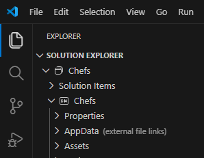

# Loading App Data

> **UnoFeatures:** `Serialization` (add to `<UnoFeatures>` in your `.csproj`).

## Problem

You need to load app data files on all platforms. Traditional file access methods (`System.IO.File.Read*`, `EmbeddedResource`) do not work for Content files on WASM.

## Solution

Use the `Windows.Storage.StorageFile` API to read files from your app package. This works the same way on all Uno Platform targets, including WASM.

- Move your data files to be included as `Content` in your project's output directory, and use `StorageFile.GetFileFromApplicationUriAsync` to load them by path. To ensure that you will always have the latest changes included, set the appropriate Property: `CopyToOutputDirectory="PreserveNewest"`.

    ```xml
    <ItemGroup>
        <Content Include="AppData\*.json" CopyToOutputDirectory="PreserveNewest" />
    </ItemGroup>
    ```

- To also display these files in your Solution Explorer, add `LinkBase="AppData"`:

    ```xml
    <ItemGroup>
        <Content Include="AppData\*.json" CopyToOutputDirectory="PreserveNewest" LinkBase="AppData" />
    </ItemGroup>
    ```

    

    > [!TIP]
    > Using `LinkBase` allows multiple projects in your solution to reference the same files without duplication while keeping them synchronized across all projects.
    >
    > See [MSBuild LinkBase documentation](https://learn.microsoft.com/en-us/dotnet/core/project-sdk/msbuild-props#linkbase) for details.

- Loading a JSON File Using `StorageFile`

    ```csharp
    public abstract class BaseMockEndpoint(ISerializer serializer, ILogger<BaseMockEndpoint> _logger)
    {
        protected async Task<T?> LoadData<T>(string fileName)
        {
            try
            {
                var file = await StorageFile.GetFileFromApplicationUriAsync(new Uri($"ms-appx:///AppData/{fileName}"));
                var json = await FileIO.ReadTextAsync(file);
                return serializer.FromString<T>(json);
            }
                catch (Exception ex)
            {
                _logger.LogError(ex, "Failed to load {FileName}", fileName);
                return default;
            }
        }
    }
    ```

    > [!NOTE]
    > This sample utilizes `ISerializer` from Uno Extensions Serialization to deserialize the JSON content into a strongly-typed object.
    > See the [Serialization documentation](xref:Uno.Recipes.Serialization) for more details and the [Walkthrough: Serialize JSON with Source Generators](xref:Uno.Extensions.Serialization.HowTo) for guidance on setting it up.
    > [!TIP]
    > Alternatively to `StorageFile`, you can use [`IStorage` from Uno Extensions Storage](xref:Uno.Extensions.Storage.Overview), which not only allows you to replace it with only one simple call to `IStorage.ReadPackageFileAsync<TData>(string path)` to get the same result with build-in serialization support, but also to provide your own `ISerializer` implementation if needed.

- Using `LoadData` in `MockRecipeEndpoints`

    ```csharp
    public class MockRecipeEndpoints(string basePath, ISerializer serializer, ILogger<BaseMockEndpoint> logger) : BaseMockEndpoint(serializer, logger)
    {
        public async Task<string> HandleRecipesRequest(HttpRequestMessage request)
        {
            var savedList = await LoadData<List<Guid>>("SavedRecipes.json") ?? [];
            var allRecipes = await LoadData<List<RecipeData>>("Recipes.json") ?? [];
            ...
        }
    }
    ```

## Source Code

- [BaseMockEndpoint](https://github.com/unoplatform/uno.chefs/blob/060fe206b949c23ca96ad15374a8b6b2d337bd33/Chefs/Services/MockEndpoints/BaseMockEndpoint.cs)
- [MockRecipeEndpoints](https://github.com/unoplatform/uno.chefs/blob/060fe206b949c23ca96ad15374a8b6b2d337bd33/Chefs/Services/MockEndpoints/MockRecipeEndpoints.cs#L8)
- [Recipes.json](https://github.com/unoplatform/uno.chefs/blob/060fe206b949c23ca96ad15374a8b6b2d337bd33/AppData/Recipes.json)

## Documentation

- [File Management documentation](xref:Uno.Features.FileManagement)
