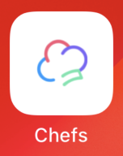
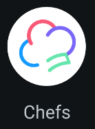
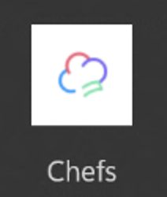
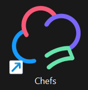

# How to use generated app icons with Uno Resizetizer

## Problem

App icon requirements can vary between platforms, and it can be time-consuming to create and manage all the different sizes and formats. 

## Solution

The Uno Resizetizer tool can generate all the required app icons for you from a single asset. This is done through the `UnoIcon` build action:

### UnoIcon Usage

Given the following `.svg` files:

- [`iconapp.svg`](https://github.com/unoplatform/uno.chefs/blob/e02a4dce407e13b933d2e8e6c764d237ebc11d33/src/Chefs.Base/Icons/iconapp.svg) (the icon background)
    
- [`appiconfg.svg`](https://github.com/unoplatform/uno.chefs/blob/e02a4dce407e13b933d2e8e6c764d237ebc11d33/src/Chefs.Base/Icons/appiconfg.svg) (the main icon)
    

```xml
<ItemGroup>
    <UnoIcon Include="$(MSBuildThisFileDirectory)Icons\iconapp.svg"
             ForegroundFile="$(MSBuildThisFileDirectory)Icons\appiconfg.svg"
             ForegroundScale="0.5"
             Color="#00000000" />
</ItemGroup>
```

iOS|Android|Windows|WASM (PWA Icon)
-|-|-|-
|||

## Source Code

Chefs app

- [`base.props`](https://github.com/unoplatform/uno.chefs/blob/e02a4dce407e13b933d2e8e6c764d237ebc11d33/src/Chefs.Base/base.props#L37-L44)

## Documentation

- [Resizetizer UnoIcon documentation](xref:Uno.Resizetizer.GettingStarted#unoicon)
