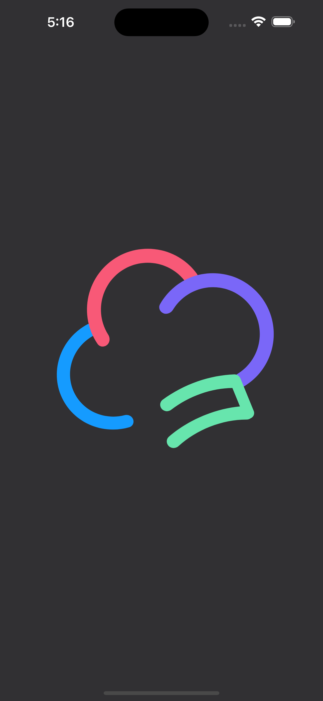
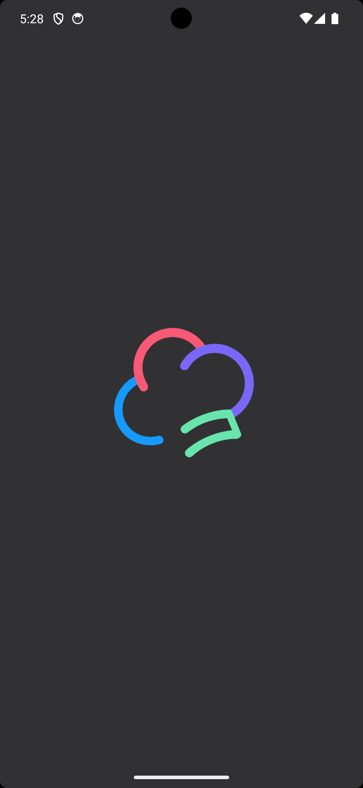
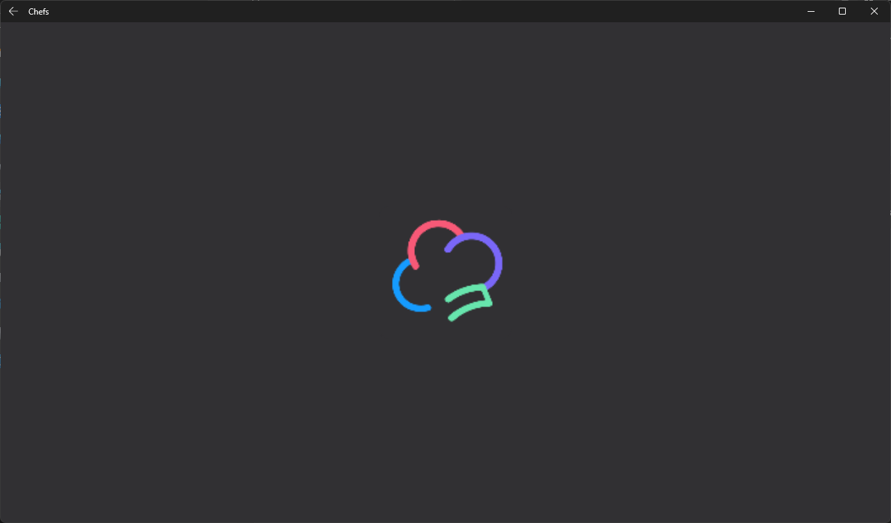
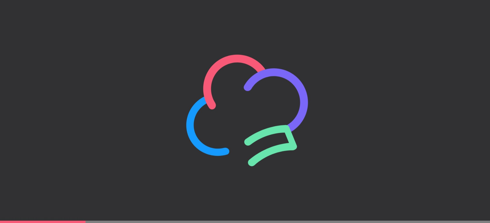

# App Icons and Splash Screen

## Problem

App icon requirements can vary between platforms, and it can be time-consuming to create and manage all the different sizes and formats.

## Solution

The Uno Resizetizer tool can generate all the required app icons and splash screens for you from a single asset each.

### Retaining image file names

When you create a new Uno Platform application, an **Icons** folder is automatically generated under the **Assets** directory. This folder contains two files named `icon.svg` and `icon_foreground.svg`. You can replace the images while retaining the file names and Uno Resisetizer will handle the rest.

### Using custom image file names

In Chefs, we use the Uno Platform SDK properties relating to `UnoIcon` and `UnoSplashScreen` to define our own file names for both the icon and splash screen when the current build is from the canary branch:

Given the following `.svg` files:

- [`icon_foreground_canary.svg`](https://github.com/unoplatform/uno.chefs/blob/19ace5c583ef4ef55f019589dd1eb07e43000de9/src/Chefs/Assets/Icons/icon_foreground_canary.svg)
- [`splash_screen_canary.svg`](https://github.com/unoplatform/uno.chefs/blob/19ace5c583ef4ef55f019589dd1eb07e43000de9/src/Chefs/Assets/Splash/splash_screen_canary.svg)

And in the project properties file:

```xml
<PropertyGroup>
    <UnoSplashScreenColor>#313033</UnoSplashScreenColor>
    <UnoIconForegroundScale>0.5</UnoIconForegroundScale>
    <UnoSplashScreenBaseSize>350,300</UnoSplashScreenBaseSize>
    <UnoIconForegroundFile>Assets/Icons/icon_foreground_canary.svg</UnoIconForegroundFile>
    <UnoSplashScreenFile>Assets/Splash/splash_screen_canary.svg</UnoSplashScreenFile>
</PropertyGroup>
```

For more information on the different `UnoIcon` and `UnoSplashScreen` properties you can refer to the [documentation](xref:Uno.Resizetizer.GettingStarted#unoicon).

#### App Icon

iOS|Android|Windows|WASM (PWA Icon)
-|-|-|-
|||

#### Splash screen

iOS|Android
-|-
|

#### Desktop

Windows|WASM
-|-
|

## Source Code

- [`Chefs.csproj`](https://github.com/unoplatform/uno.chefs/blob/139edc9eab65b322e219efb7572583551c40ad32/Chefs/Chefs.csproj#L120-L126)

## Documentation

- [Uno Resizetizer documentation](xref:Uno.Resizetizer.GettingStarted)
