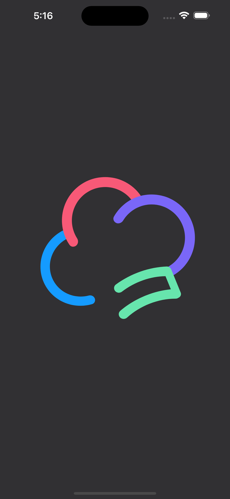
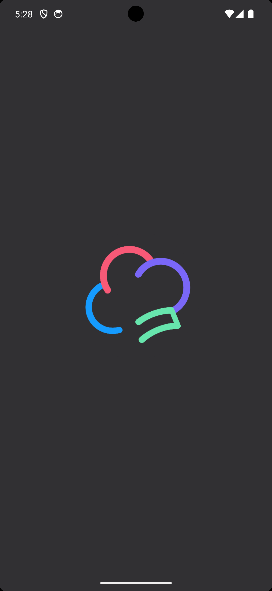
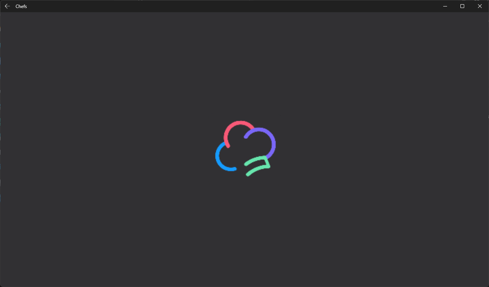
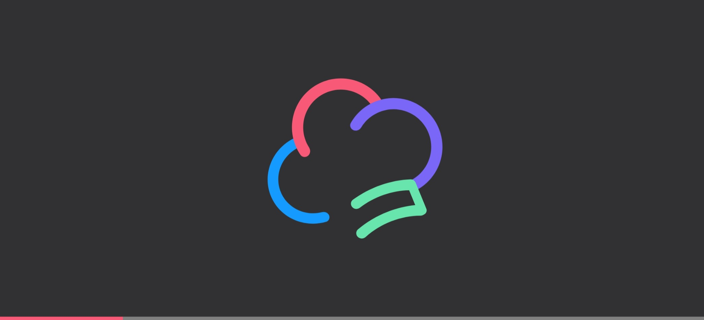

# How to use a generated splash screen with Uno Resizetizer

## Problem

Splash screen requirements vary between platforms, and it can be time-consuming to create and manage all the different sizes and formats of the splash screen assets.

## Solution

The Uno Resizetizer tool can generate a splash screen and customize its scaling and color from a single asset. This is done through the `UnoSplashScreen` build action:

### UnoSplashScreen Usage

Given the following `.svg` files and MSBuild properties:

- [`splash_screen.svg`](https://github.com/unoplatform/uno.chefs/blob/e02a4dce407e13b933d2e8e6c764d237ebc11d33/src/Chefs.Base/Splash/splash_screen.svg)
    

```xml
<ItemGroup>
    <UnoSplashScreen Include="$(MSBuildThisFileDirectory)Splash\splash_screen.svg"
                     Color="#313033" />
</ItemGroup>
```

The `UnoSplashScreen` build action will generate the splash screen assets for each platform, and the color will be used as the background color for the splash screen.

#### Mobile

iOS|Android
-|-
|

#### Desktop

Windows|WASM
-|-
|

## Source Code

Chefs app

- [`base.props`](https://github.com/unoplatform/uno.chefs/blob/e02a4dce407e13b933d2e8e6c764d237ebc11d33/src/Chefs.Base/base.props#L17-L19)

## Documentation

- [Resizetizer UnoSplashScreen documentation](xref:Uno.Resizetizer.GettingStarted#unosplashscreen)
