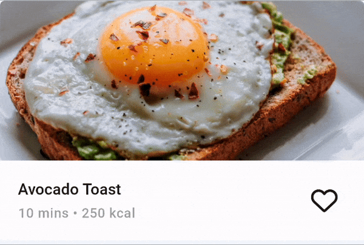

# ToggleButton Alternate Icons

## Problem

The base `ToggleButton` control does not provide a way to switch its content when toggled. This is a common pattern in modern UIs, where a `ToggleButton` can be used to switch between two states, and the content should change accordingly.

## Solution

The [Uno Themes library](xref:Uno.Themes.Overview) provides a set of attached properties grouped under the `ControlExtensions` class. One of these attached properties is the `AlternateContent` property. The [Uno Material library](xref:Uno.Themes.Material.GetStarted) provides custom styles for the `ToggleButton` that support the `AlternateContent` property.

### ToggleButton AlternateContent

Given the following XAML:

```xml
<ToggleButton Style="{StaticResource IconToggleButtonStyle}"
              IsChecked="{Binding IsFavorite}"
              Command="{utu:AncestorBinding AncestorType=uer:FeedView,
                                            Path=DataContext.FavoriteRecipe}"
              CommandParameter="{Binding}">
    <ToggleButton.Content>
        <PathIcon Data="{StaticResource Icon_Heart}"
                  Foreground="{ThemeResource OnSurfaceBrush}" />
    </ToggleButton.Content>
    <ut:ControlExtensions.AlternateContent>
        <PathIcon Data="{StaticResource Icon_Heart_Filled}"
                  Foreground="{ThemeResource PrimaryBrush}" />
    </ut:ControlExtensions.AlternateContent>
</ToggleButton>
```



## Source Code

- [Home Page](https://github.com/unoplatform/uno.chefs/blob/139edc9eab65b322e219efb7572583551c40ad32/Chefs/Views/HomePage.xaml#L55-L58)
- [Recipe Details Page](https://github.com/unoplatform/uno.chefs/blob/139edc9eab65b322e219efb7572583551c40ad32/Chefs/Views/RecipeDetailsPage.xaml#L363-L374)

## Documentation

- [AlternateContent ControlExtensions documentation](xref:Uno.Themes.Control.Extensions#alternate-content)
