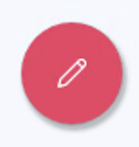
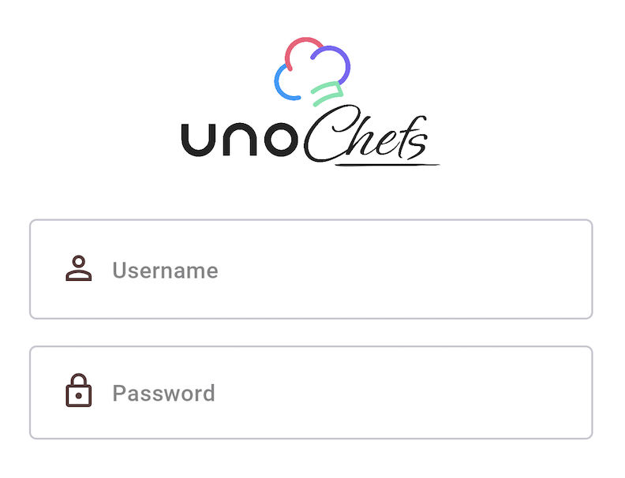

# How to add custom icons to supported controls

## Problem

Some controls do not offer support for custom icons, and would normally require a custom style to edit the control's template to support `IconElement`s.

## Solution

The Uno Themes library provides a set of attached properties grouped under the `ControlExtensions` class. One of these attached properties is the `Icon` property, which allows you to add custom icons to certain controls. Specific styles are provided for each control to support the `Icon` property.

### Button Icon

Given the following XAML:

```xml
<Page ...
      xmlns:ut="using:Uno.Themes">

    <Button Style="{StaticResource FabStyle}">
        <ut:ControlExtensions.Icon>
            <SymbolIcon Symbol="Edit" />
        </ut:ControlExtensions.Icon>
    </Button>

</Page>
```



### TextBox Icon

[!code-xml[](../../Chefs/Views/LoginPage.xaml#L29-L38)]

### PasswordBox Icon

```xml
    <PasswordBox PlaceholderText="Password"
                 Style="{StaticResource OutlinedPasswordBoxStyle}">
        <ut:ControlExtensions.Icon>
            <FontIcon Glyph="{StaticResource Icon_Lock}" />
        </ut:ControlExtensions.Icon>
    </PasswordBox>
```



## Source Code

Chefs app

- [Login Page (TextBox)](https://github.com/unoplatform/uno.chefs/blob/139edc9eab65b322e219efb7572583551c40ad32/Chefs/Views/LoginPage.xaml#L35-L37)
- [Login Page (PasswordBox)](https://github.com/unoplatform/uno.chefs/blob/139edc9eab65b322e219efb7572583551c40ad32/Chefs/Views/LoginPage.xaml#L60-L62)
- [Settings Page (TextBox)](https://github.com/unoplatform/uno.chefs/blob/139edc9eab65b322e219efb7572583551c40ad32/Chefs/Views/SettingsPage.xaml#L49-L52)
- [Favorite Recipes Page (Button)](https://github.com/unoplatform/uno.chefs/blob/139edc9eab65b322e219efb7572583551c40ad32/Chefs/Views/FavoriteRecipesPage.xaml#L57-L60)
- [Profile Page (Button)](https://github.com/unoplatform/uno.chefs/blob/139edc9eab65b322e219efb7572583551c40ad32/Chefs/Views/ProfilePage.xaml#L49-L52)
- [Live Cooking Page (Button)](https://github.com/unoplatform/uno.chefs/blob/139edc9eab65b322e219efb7572583551c40ad32/Chefs/Views/LiveCookingPage.xaml#L233-L235)

## Documentation

- [Icon ControlExtensions documentation](xref:Uno.Themes.Control.Extensions#icon)
