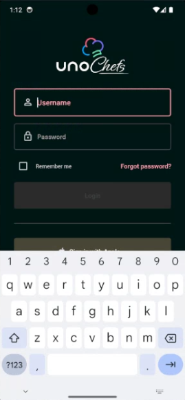
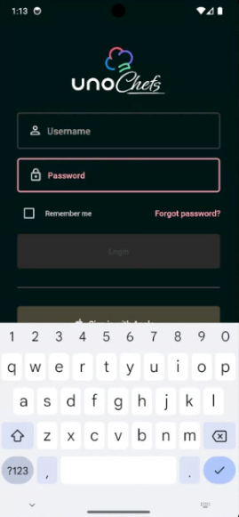

# How to Use the InputExtensions.ReturnType Property

## Problem

There is no cross-platform method to set the on-screen keyboard's return key for input controls like `TextBox` and `PasswordBox`. Normally, you would need to use platform conditionals to set the `ImeOptions` or the `ReturnKeyType` properties for Android and iOS, respectively.

## Solution

The `InputExtensions` class, provided by **Uno.Toolkit**, includes the `InputExtensions.ReturnType` property which simplifies setting the return type for input controls, ensuring a consistent user experience across all platforms.


In the Chefs app, the `LoginPage` sets the return type for `TextBox` and `PasswordBox` controls without needing platform specific properties:

```xml
...

<TextBox PlaceholderText="Username"
         utu:InputExtensions.ReturnType="Next" />


<PasswordBox x:Name="LoginPassword"
             utu:InputExtensions.ReturnType="Done"/>
             
...
```

The above code has the following effect:
<table>
  <tr>
    <th>ReturnType.Next</th>
    <th>ReturnType.Done</th>
  </tr>
  <tr>
     <td></td>
     <td></td>
  </tr>
</table>

## Source Code

Chefs app

- [Login Page](https://github.com/unoplatform/uno.chefs/blob/57492ecaf328df3437fe42777f1c085e6fda8212/src/Chefs/Views/LoginPage.xaml)
- [Registration Page](https://github.com/unoplatform/uno.chefs/blob/57492ecaf328df3437fe42777f1c085e6fda8212/src/Chefs/Views/RegistrationPage.xaml)

## Documentation

- [InputExtensions documentation](xref:Toolkit.Helpers.InputExtensions)