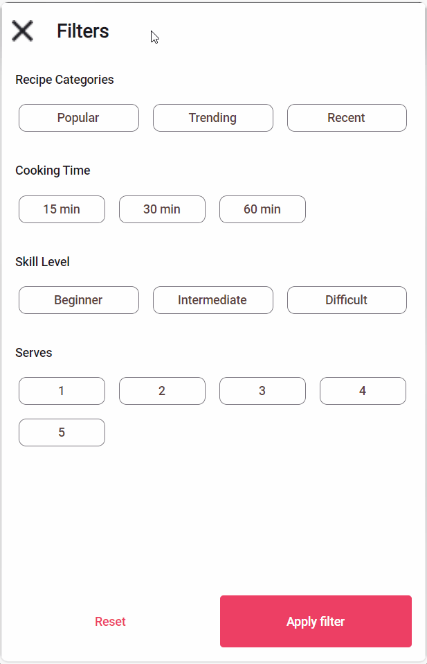

# How to enable common selection policies on the ItemsRepeater control

## Problem

While the [`ItemsRepeater` control](https://learn.microsoft.com/en-us/windows/apps/design/controls/items-repeater) provides a flexible system for creating custom layouts, it lacks built-in support for common selection policies. For example, the `ListView` control has built-in support for single and multiple selection modes, but the ItemsRepeater control does not.

## Solution

The `ItemsRepeater` extensions library provides attached properties that enable common selection policies on the `ItemsRepeater` control. This allows you to easily implement single, multiple, and single-or-none selection modes on the `ItemsRepeater` control.

```xml
<muxc:ItemsRepeater ItemsSource="{Binding Times}"
                    utu:ItemsRepeaterExtensions.SelectedItem="{Binding Filter.Time, Mode=TwoWay}"
                    utu:ItemsRepeaterExtensions.SelectionMode="SingleOrNone">
    <muxc:ItemsRepeater.Layout>
    ...
    </muxc:ItemsRepeater.Layout>
    <muxc:ItemsRepeater.ItemTemplate>
        <DataTemplate>
        ...
        </DataTemplate>
    </muxc:ItemsRepeater.ItemTemplate>
</muxc:ItemsRepeater>
```

The above code has the following effect:
<table>
  <tr>
    <th>SingleOrNone Selection Mode</th>
  </tr>
  <tr>
   <td></td>
  </tr>
</table>

## Source Code

Chefs app
- [Filters Page (1)](https://github.com/unoplatform/uno.chefs/blob/1c8e881d6b2f824ea460da2c449daf82dd38e165/src/Chefs/Views/FiltersPage.xaml#L55)
- [Filters Page (2)](https://github.com/unoplatform/uno.chefs/blob/1c8e881d6b2f824ea460da2c449daf82dd38e165/src/Chefs/Views/FiltersPage.xaml#L74)
- [Filters Page (3)](https://github.com/unoplatform/uno.chefs/blob/1c8e881d6b2f824ea460da2c449daf82dd38e165/src/Chefs/Views/FiltersPage.xaml#L102)
- [Filters Page (4)](https://github.com/unoplatform/uno.chefs/blob/1c8e881d6b2f824ea460da2c449daf82dd38e165/src/Chefs/Views/FiltersPage.xaml#L121)

## Documentation

- [ItemsRepeater Extensions documentation](xref:Toolkit.Helpers.ItemRepeaterExtensions)