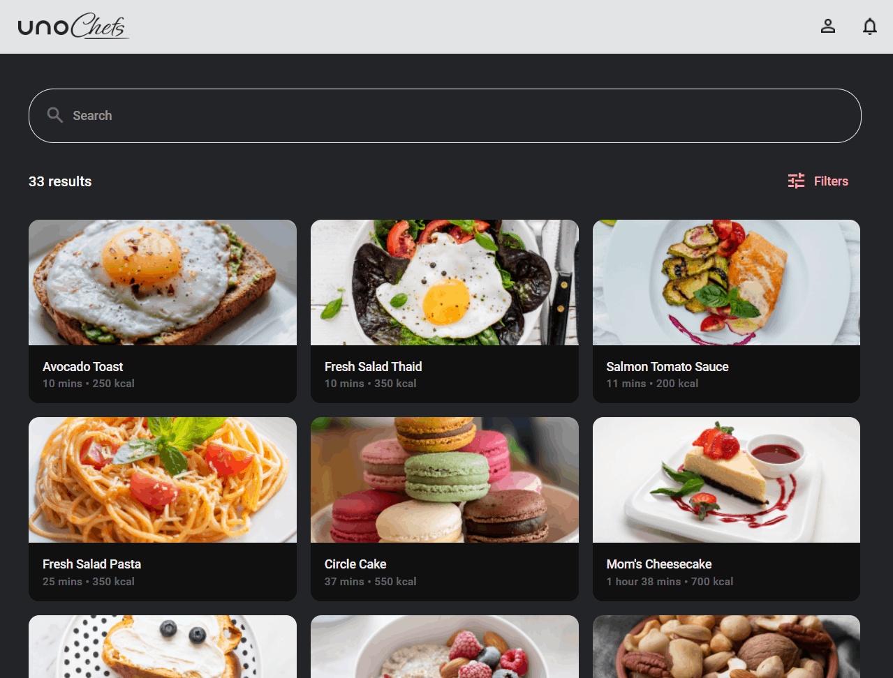

# How to enable selection on the ItemsRepeater control

## Problem

While the [`ItemsRepeater` control](https://learn.microsoft.com/en-us/windows/apps/design/controls/items-repeater) provides a flexible system for creating custom layouts, it lacks built-in support for common selection policies. For example, the `ListView` control has built-in support for single and multiple selection modes, but the ItemsRepeater control does not.

## Solution

The `ItemsRepeater` extensions library provides attached properties that enable common selection policies on the `ItemsRepeater` control. This allows you to easily implement single, multiple, and single-or-none selection modes on the `ItemsRepeater` control.

```xml
<muxc:ItemsRepeater ItemsSource="{Binding Times}"
                    utu:ItemsRepeaterExtensions.SelectedItem="{Binding Filter.Time, Mode=TwoWay}"
                    utu:ItemsRepeaterExtensions.SelectionMode="SingleOrNone">
```



## Source Code

- [Filters Page (FilterGroups ItemsRepeater)](https://github.com/unoplatform/uno.chefs/blob/139edc9eab65b322e219efb7572583551c40ad32/Chefs/Views/FiltersPage.xaml#L52)
- [Filters Page (Times ItemsRepeater)](https://github.com/unoplatform/uno.chefs/blob/139edc9eab65b322e219efb7572583551c40ad32/Chefs/Views/FiltersPage.xaml#L71)
- [Filters Page (Difficulties ItemsRepeater)](https://github.com/unoplatform/uno.chefs/blob/139edc9eab65b322e219efb7572583551c40ad32/Chefs/Views/FiltersPage.xaml#L99)
- [Filters Page (Serves ItemsRepeater)](https://github.com/unoplatform/uno.chefs/blob/139edc9eab65b322e219efb7572583551c40ad32/Chefs/Views/FiltersPage.xaml#L118)

## Documentation

- [ItemsRepeater Extensions documentation](xref:Toolkit.Helpers.ItemRepeaterExtensions)
