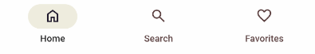
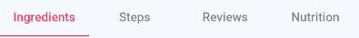

# How to Navigate Using a TabBar

## Problem

Navigating between different sections or categories in an Uno Platform application can be challenging without an intuitive and accessible UI component.

## Solution

The `TabBar` control in Uno Platform, part of the **Uno.Toolkit** library, offers a streamlined way to include navigation within your app. It allows users to switch between main areas of the app effortlessly.

- [Include](https://github.com/unoplatform/uno.chefs/blob/f7ccfcc2d47d7d45e2ae34a1a251d8c95311c309/src/Chefs/Views/MainPage.xaml#L9-L10) the Uno Extensions Navigation and Toolkit namespace in your XAML:

    ```xml
    xmlns:uen="using:Uno.Extensions.  Navigation.UI"
    xmlns:utu="using:Uno.Toolkit.UI"
    ```

- Define a TabBar in your MainPage XAML to handle main navigation between core sections like Home, Search, and Favorites in the `Chefs` app.

  ```xml
  <utu:TabBar x:Name="MainTabs" SelectionChanged="OnTabSelectionChanged">
      <utu:TabBarItem Icon="Home" Label="Home" />
      <utu:TabBarItem Icon="Search" Label="Search" />
      <utu:TabBarItem Icon="Favorite" Label="Favorites" />
  </utu:TabBar>
  ```

- Top TabBar for Subcategories:

  On pages requiring sub-navigation, implement a secondary TabBar to toggle between options such as Ingredients, Steps, Reviews, and Nutrition in the `Chefs` app.

  ```xml
  <utu:TabBar x:Name="DetailTabs">
  <utu:TabBarItem Label="Ingredients" />
  <utu:TabBarItem Label="Steps" />
  <utu:TabBarItem Label="Reviews" />
  <utu:TabBarItem Label="Nutrition" />
  </utu:TabBar>
  ```

- Using Region-Based Navigation

  This solution combines the `TabBar` from Uno Toolkit with the `Navigation Extensions` from Uno Extensions, utilizing region-based navigation. Region-based navigation allows for more advanced navigation scenarios by specifying the navigator type and setting up regions. For more information, refer to the [How To Use TabBar](https://platform.uno/docs/articles/external/uno.extensions/doc/Learn/Navigation/Advanced/HowTo-UseTabBar.html#3-set-up-regions-and-specify-navigator-type) documentation.  

# Example Usage in Chefs

The above code has the following effect:

- Main Navigation Tab Bar:
  

- Top Tab Bar:
  

## Source Code

- [Main Navigation TabBar](https://github.com/unoplatform/uno.chefs/blob/f7ccfcc2d47d7d45e2ae34a1a251d8c95311c309/src/Chefs/Views/MainPage.xaml#L41-L74)

- [Recipe Detail Top TabBar](https://github.com/unoplatform/uno.chefs/blob/f7ccfcc2d47d7d45e2ae34a1a251d8c95311c309/src/Chefs/Views/RecipeDetailsPage.xaml#L166-L181)

## Documentation

- [Using TabBar for Navigation](xref:Uno.Extensions.Navigation.Advanced.TabBar)