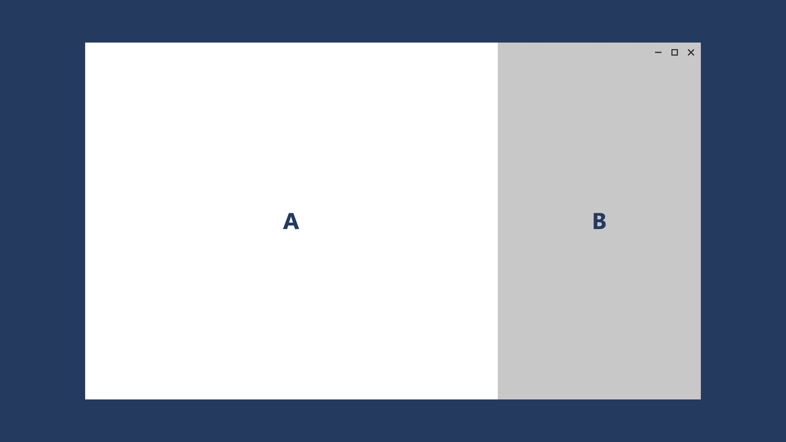
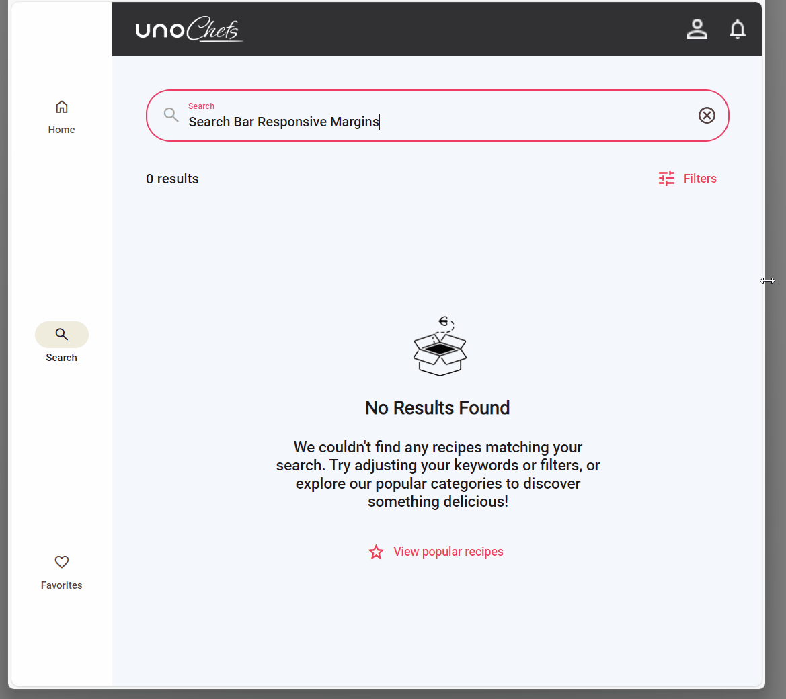

# How to adapt properties based on screen size in XAML

## Problem

XAML currently lacks a simple and flexible approach for creating responsive layouts. While options like `VisualStates` with `AdaptiveTriggers` exist, they can become cumbersome even in simple scenarios that do not involve significant UI structure changes based on screen size.

## Solution

The `ResponsiveExtension` class is a markup extension that enables the customization of `UIElement` properties based on screen size.

`ResponsiveExtension` is conceived as a lightweight approach to responsiveness. For more complex scenarios, where the UI structure changes significantly based on screen size, consider using the [`ResponsiveView`](xref:Toolkit.Controls.ResponsiveView) control.

[!code-xml]

## Source Code

- [Main Page (1)](https://github.com/unoplatform/uno.chefs/blob/139edc9eab65b322e219efb7572583551c40ad32/Chefs/Views/MainPage.xaml#L38-L39)
- [Main Page (2)](https://github.com/unoplatform/uno.chefs/blob/139edc9eab65b322e219efb7572583551c40ad32/Chefs/Views/MainPage.xaml#L69-L70)
- [Search Page](https://github.com/unoplatform/uno.chefs/blob/139edc9eab65b322e219efb7572583551c40ad32/Chefs/Views/SearchPage.xaml#L110-L111)
- [Home Page](https://github.com/unoplatform/uno.chefs/blob/139edc9eab65b322e219efb7572583551c40ad32/Chefs/Views/HomePage.xaml#L271-L272)
- [Recipe Details Page](https://github.com/unoplatform/uno.chefs/blob/139edc9eab65b322e219efb7572583551c40ad32/Chefs/Views/RecipeDetailsPage.xaml#L29-L30)
- [Create/Update Cookbook Page](https://github.com/unoplatform/uno.chefs/blob/139edc9eab65b322e219efb7572583551c40ad32/Chefs/Views/CreateUpdateCookbookPage.xaml#L23-L30)
- [Cookbook Details Page](https://github.com/unoplatform/uno.chefs/blob/139edc9eab65b322e219efb7572583551c40ad32/Chefs/Views/CookbookDetailPage.xaml#L23-L30)
- [Favorite Recipes Page](https://github.com/unoplatform/uno.chefs/blob/139edc9eab65b322e219efb7572583551c40ad32/Chefs/Views/FavoriteRecipesPage.xaml#L22-L29)
- [Live Cooking Page](https://github.com/unoplatform/uno.chefs/blob/139edc9eab65b322e219efb7572583551c40ad32/Chefs/Views/LiveCookingPage.xaml#L34)
- [Chart Control](https://github.com/unoplatform/uno.chefs/blob/139edc9eab65b322e219efb7572583551c40ad32/Chefs/Views/Controls/ChartControl.xaml#L36)

## Documentation

- [ResponsiveExtension documentation](xref:Toolkit.Helpers.ResponsiveExtension)
