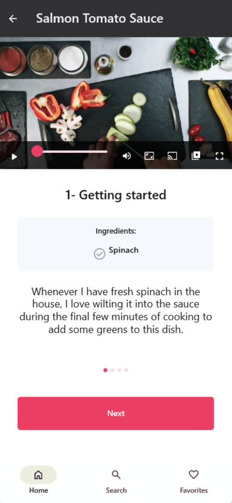
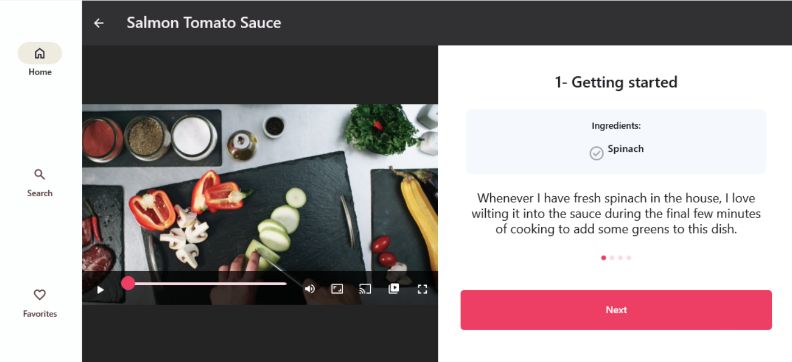

# How to easily turn static layouts into responsive ones in XAML

## Problem

XAML currently lacks a simple and flexible approach for creating responsive layouts. While options like `VisualStates` with `AdaptiveTriggers` exist, they can become cumbersome even in simple scenarios that do not involve significant UI structure changes based on screen size.

For example, switching between a navigation pane with a compact UI for smaller screens and a tab-based layout for larger displays requires intricate setups using multiple named containers, visibility states, and triggers.

## Solution

The `ResponsiveExtension` class is a markup extension that enables the customization of `UIElement` properties based on screen size.

<table>
  <tr>
    <th>Typical scenario</th>
  </tr>
  <tr>
   <td></td>
  </tr>
</table>

`ResponsiveExtension` is conceived as a lightweight approach to responsiveness. For more complex scenarios, where the UI structure changes significantly based on screen size, consider using the [`ResponsiveView`](https://platform.uno/docs/articles/external/uno.toolkit.ui/doc/controls/ResponsiveView.html) control.

```xml
<utu:AutoLayout Padding="{utu:Responsive Narrow=32,Wide=40}"
                PrimaryAxisAlignment="{utu:Responsive Narrow=Start, Wide=Center}">
                ...
</utu:AutoLayout>
```

The above code has the following effect:
<table>
  <tr>
    <th>Narrow Mode</th>
    <th>Wide Mode</th>
  </tr>
  <tr>
   <td></td>
   <td></td>
  </tr>
</table>

### Source Code

Chefs app
- [Main Page](https://github.com/unoplatform/uno.chefs/blob/main/src/Chefs/Views/MainPage.xaml#L44)
- [Search Page](https://github.com/unoplatform/uno.chefs/blob/main/src/Chefs/Views/SearchPage.xaml#L148)
- [Home Page](https://github.com/unoplatform/uno.chefs/blob/main/src/Chefs/Views/HomePage.xaml#L290)
- [Recipe Details Page](https://github.com/unoplatform/uno.chefs/blob/main/src/Chefs/Views/RecipeDetailsPage.xaml#L24)
- [Create/Update Cookbook Page](https://github.com/unoplatform/uno.chefs/blob/main/src/Chefs/Views/CreateUpdateCookbookPage.xaml#L161)
- [Cookbook Details Page](https://github.com/unoplatform/uno.chefs/blob/main/src/Chefs/Views/CookbookDetailPage.xaml#L123)
- [Favorite Recipes Page](https://github.com/unoplatform/uno.chefs/blob/main/src/Chefs/Views/FavoriteRecipesPage.xaml#L331)
- [Live Cooking Page](https://github.com/unoplatform/uno.chefs/blob/main/src/Chefs/Views/LiveCookingPage.xaml#L34)
- [Chart Control](https://github.com/unoplatform/uno.chefs/blob/main/src/Chefs/Views/Controls/ChartControl.xaml#L36)

### Documentation

- Uno Toolkit UI [ResponsiveExtension documentation](https://platform.uno/docs/articles/external/uno.toolkit.ui/doc/helpers/responsive-extension.html)