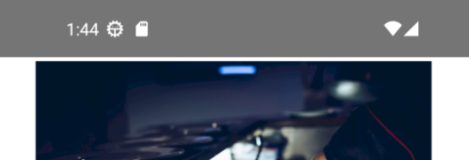
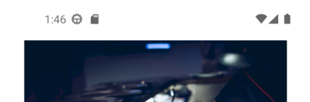
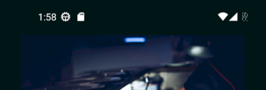

# Customizing Status Bar Colors on Mobile

## Problem

iOS and Android provide default appearances for the status bar, but developers often need to customize it to match their app's design or theme.

## Solution

StatusBar extensions provide a quick way to set the background and foreground colors of the current page's status bar.

```xml
<Page ...
      xmlns:utu="using:Uno.Toolkit.UI"
      utu:StatusBar.Background="{ThemeResource SurfaceBrush}"
      utu:StatusBar.Foreground="Auto">

      ...

</Page>
```

For iOS add:

```xml
<!--info.plist-->
<key>UIViewControllerBasedStatusBarAppearance</key>
<false/>
```

The above code has the following effect:

Not set|Light mode|Dark mode
-|-|-
||

## Source Code

- [Home Page](https://github.com/unoplatform/uno.chefs/blob/139edc9eab65b322e219efb7572583551c40ad32/Chefs/Views/HomePage.xaml#L12-L13)
- [Login Page](https://github.com/unoplatform/uno.chefs/blob/139edc9eab65b322e219efb7572583551c40ad32/Chefs/Views/LoginPage.xaml#L12-L13)

## Documentation

- [StatusBar documentation](xref:Toolkit.Helpers.StatusBarExtensions)
